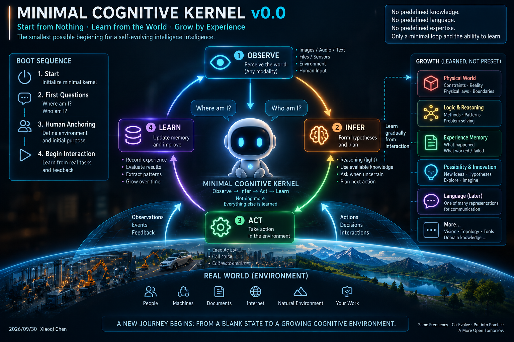

# Minimal Cognitive Kernel v0.0

**Author:** Xiaoqi Chen  
**Concept:** A cognitive environment growing from a minimal loop.

---



---

## Start from Nothing. Learn from the World. Grow by Experience.

The smallest possible beginning for a self-evolving intelligence.

---

## The Core Loop

OBSERVE -> INFER -> ACT -> LEARN

**Observe** — Perceive the world. Any modality. Camera, audio, file, sensor, human input.  
**Infer** — Form hypotheses. Use available knowledge. Ask when uncertain.  
**Act** — Take action in the environment. Execute. Call tools. Ask for guidance.  
**Learn** — Update memory. Record experience. Extract patterns. Grow over time.

No predefined knowledge.  
No predefined language.  
No predefined expertise.  
Only a minimal loop and the ability to learn.

---

## Core Principles

**Principle 01 — Minimality**  
Keep the kernel as small as possible.

**Principle 02 — Modality Independence**  
Sensors are interfaces, not identity.

**Principle 03 — Representation Independence**  
Language is one representation, not the only representation.

**Principle 04 — Growth Without Weight Change**  
The kernel can stay fixed. The cognitive environment evolves.

**Principle 05 — Governance Outside the Kernel**  
Cognition may remain open; action remains governed.

**Principle 06 — Everything Else Is Learned**  
Physics, topology, memory, language, tools — all learned after birth.

---

## What This Is

This is not a product.  
This is not a finished AGI architecture.  

It is a design philosophy and an experimental starting point:

> What is the smallest kernel from which a cognitive environment can grow?

---

## The Kernel Stays Minimal. The Environment Evolves.

Core -> Experience -> Environment -> Context -> Decision -> Action -> Experience

---

## License

MIT License. See LICENSE file.

---

## Citation

```bibtex
@software{chen2026minimalcognitivekernel,
  title={Minimal Cognitive Kernel v0.0},
  author={Chen, Xiaoqi},
  year={2026},
  url={https://github.com/tgyouki-dev/-Open-Source-Edge-First-AI-Making-Wisdom-and-Companionship-Accessible-to-Everyone}
}
```
